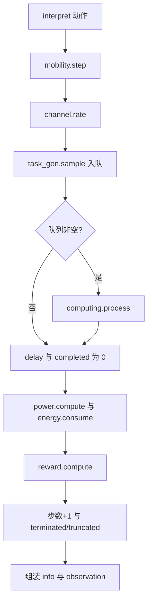

# DroneEnv 环境与模块说明

本文说明**当前 Hydra 默认配置**下仿真环境的组成、`DroneEnv` 的**处理流程**，以及各可替换模块的**注册名、配置位置与行为要点**，并附命令行与代码示例。实现细节以源码为准。

**相关文档**：《架构与使用指南.md》（训练、Hydra、RL 后端）；《规划文档.md》（顶层设计）；根目录 `README.md`（快速命令）。

---

## 1. 配置如何进入环境

- **总入口**：`configs/config.yaml` 通过 `defaults` 组合 `modules` 与 `experiment` 等。
- **环境只读 `cfg.modules`**：`EnvBuilder.build(cfg.modules)` 将各子配置的 `type` + `params` 实例化，并固定组装为 `DroneEnv`（见 `onlyuav/core/env_builder.py`）。
- **环境标量**：`env_params` 中的 `server_pos`、`max_steps`、`dt` 传入 `DroneEnv` 构造函数，**不参与** `ComponentRegistry` 实例化。

默认模块组合见 `configs/modules/default.yaml`：

```yaml
# 节选：当前默认引用的配置组
defaults:
  - mobility: simple_point_mass
  - channel: free_space
  - power: simple_power
  - task: poisson_arrival
  - computing: edge_offloading
  - energy: finite_battery
  - reward: weighted_sum
  - observation: full_obs
  - action_interpreter: standard
  - env_params: default
```

默认 `env_params`（`configs/modules/env_params/default.yaml`）：

| 字段 | 默认值 | 含义 |
|------|--------|------|
| `server_pos` | `[400, 0, 50]` | 边缘服务器三维位置（米量级，与信道/距离一致即可） |
| `max_steps` | `200` | 单回合最大步数，达到则 `truncated=True` |
| `dt` | `1.0` | 物理步长（秒），传入 `DroneEnv` 与部分机动模块 |

---

## 2. `DroneEnv` 在 Gymnasium 中的接口

- **类位置**：`onlyuav/envs/drone_env.py`。
- **动作空间**：`Box(3,)`，`low=[-1,-1,0]`，`high=[1,1,1]`。前两维经机动模块解释为平面加速度控制；第三维经 `StandardInterpreter` 映射为**是否卸载到边缘**（`>0.5` 为卸载）。**机载 CPU 工作频率不作为策略输出**，而是由 `configs/modules/action_interpreter/standard.yaml` 中的 `fixed_local_cpu_freq` 固定（宜与 `computing` 里本地频率 `local_freq` 一致）。
- **观测空间**：`Box(8,)`，无有限边界；具体 8 维含义由当前 `observation` 模块决定（默认 `FullObs`）。

**关于观测中的 `queue_len`**：环境内有**任务 FIFO**：每步先将 `task_gen.sample` 产生的新任务入队，再**至多服务队首一个**任务。返回观测时的 `queue_len` 为**本步结束瞬间**队列中剩余任务数（已扣除本步服务的那一个）。智能体不能直接用动作「操作队列」，只能通过移动、卸载等间接影响后续完成情况；该维度用于感知**积压**。不需要时可自定义观测模块去掉该维（须同步修改 `observation_space.shape`）。
- **终止**：`terminated` 当 `energy.remaining() <= 0`；`truncated` 当 `steps >= max_steps`。
- **渲染**：`metadata["render_modes"] = []`，当前无可视化。

---

## 3. `reset` 流程

每回合开始时顺序重置内部状态与各子模块（**含 `computing`**，以便带队列的边缘计算等状态清零）：

```52:66:onlyuav/envs/drone_env.py
    def reset(self, seed=None, options=None):
        super().reset(seed=seed)
        self.steps = 0
        self.task_queue = []
        self.total_completed = 0
        self.total_delay = 0.0
        self.total_energy = 0.0
        self.last_info = {}
        self.mobility.reset()
        self.energy_model.reset()
        self.task_gen.reset()
        self.computing.reset()
        self.action_interp.reset()
        self.reward_model.reset()
        return self._get_obs(), {}
```

说明：`channel`、`power` 等一般为无状态模块，无需在环境中单独 `reset`。

---

## 4. `step` 处理流程（与源码顺序一致）

单步逻辑可概括为下图（与下面源码块一一对应）：



核心实现如下（节选）：

```68:120:onlyuav/envs/drone_env.py
    def step(self, action):
        move_cmd, offload_target, fixed_compute_for_power = self.action_interp.interpret(action)

        # 移动与信道
        state = self.mobility.step(move_cmd)
        pos, vel = state["pos"], state["vel"]
        rate = self.channel.rate(pos, self.server_pos)

        # 任务到达
        self.task_queue.extend(self.task_gen.sample(self.steps))

        # 处理任务（简化为每步最多处理一个）
        delay = 0.0
        comp_energy = 0.0
        completed = 0
        failed = 0
        if self.task_queue:
            task = self.task_queue.pop(0)
            result = self.computing.process(task, offload_target, rate)
            success = result["success"] and result["exec_time"] <= task["max_delay"]
            delay = float(result["exec_time"] if success else task["max_delay"])
            comp_energy = float(result["energy"])
            completed = int(success)
            failed = int(not success)
            self.total_completed += completed

        # 功耗与电量
        power_total = self.power.compute(vel, fixed_compute_for_power)
        self.energy_model.consume(power_total, dt=self.dt)
        self.total_delay += delay
        self.total_energy += power_total + comp_energy

        # 奖励
        reward = self.reward_model.compute(
            {"completed": completed, "energy_cost": power_total + comp_energy, "delay": delay}
        )

        self.steps += 1
        terminated = self.energy_model.remaining() <= 0.0
        truncated = self.steps >= self.max_steps
        distance = float(np.linalg.norm(pos[:2] - self.server_pos[:2]))
        info = {
            "completed": completed,
            "failed": failed,
            "delay": delay,
            "offload_target": offload_target,
            "distance": distance,
            "total_energy": self.total_energy,
            "remaining_energy": self.energy_model.remaining(),
            "completed_tasks": self.total_completed,
        }
        self.last_info = info
        return self._get_obs(), reward, terminated, truncated, info
```

**要点**：

1. **每步先机动、再算速率、再到达任务、再服务队列中队首至多一个任务**；不是多任务并行调度器。
2. **成功判定**：`computing` 返回 `success` 且 `exec_time <= task["max_delay"]`；失败或超时则 `delay` 取 `max_delay`（惩罚性时延），`completed=0`。
3. **奖励输入**：字典含本步 `completed`（0/1）、`energy_cost`（推进功耗 + 计算/通信能耗）、`delay`（秒）。

观测由 `_get_obs` 组装 `env_state` 后交给观测模块：

```122:131:onlyuav/envs/drone_env.py
    def _get_obs(self):
        state = self.mobility.state()
        env_state = {
            "pos": state["pos"],
            "vel": state["vel"],
            "energy": self.energy_model.remaining(),
            "queue_len": len(self.task_queue),
            "server_pos": self.server_pos,
        }
        return self.obs_model.get_obs(env_state)
```

默认 `FullObs` 将上式映射为 8 维向量：`[px, py, vx, vy, energy, queue_len, server_x, server_y]`（`z` 与速度 `z` 分量不进入默认观测，见该模块实现）。

---

## 5. 每一步返回的 `info` 字段

| 键 | 类型含义 | 说明 |
|----|-----------|------|
| `completed` | int 0/1 | 本步是否成功完成一个任务 |
| `failed` | int 0/1 | 本步是否未成功完成 |
| `delay` | float | 本步计入的时延（秒） |
| `offload_target` | int | 动作解释后的卸载目标（由 `action_interpreter` 定义，通常为 0 本地 / 1 边缘） |
| `distance` | float | 无人机与服务器在 **xy 平面**上的距离 |
| `total_energy` | float | 回合内累计能耗（推进 + 本步计算侧能耗） |
| `remaining_energy` | float | 当前剩余电量 |
| `completed_tasks` | int | 回合内累计成功完成任务数 |

---

## 6. 模块一览（注册名与配置文件）

Hydra 中通过 **`modules/<领域>=<配置文件名>`** 切换实现（不含 `.yaml` 后缀）。下表列出当前仓库已注册类型及典型配置路径。

### 6.1 机动 `mobility`（`IMobility`）

| 注册名 `type` | YAML 示例 | 说明 |
|----------------|-----------|------|
| `SimplePointMass` | `configs/modules/mobility/simple_point_mass.yaml` | 二维加速度驱动质点，有最大速度与边界；`dt` 与 `DroneEnv.dt` 宜一致。 |
| `RandomWaypoint` | `configs/modules/mobility/random_waypoint.yaml` | **忽略 RL 移动动作**，按随机路点飞行；仅卸载/频率仍由策略控制。 |

### 6.2 信道 `channel`（`IChannel`）

| 注册名 | YAML 示例 | 说明 |
|--------|-----------|------|
| `FreeSpace` | `channel/free_space.yaml` | 自由空间路径损耗 + Shannon 容量。 |
| `ProbabilisticLOS` | `channel/prob_los.yaml` | 分段 LOS 概率，对 NLOS 附加损耗；实现上使用**期望接收功率**得确定性速率。 |
| `InterferenceLimited` | `channel/interference_limited.yaml` | 在 Shannon 容量上乘 **orthogonality_factor**（有效带宽/频谱效率）。 |
| `SpectrumSharing` | `channel/spectrum_sharing.yaml` | 在容量上乘 **(1 - interference_factor)**，宏观干扰占位。 |

### 6.3 功耗 `power`（`IPower`）

| 注册名 | YAML 示例 | 说明 |
|--------|-----------|------|
| `SimplePower` | `power/simple_power.yaml` | 悬停基础功率 + 与速度相关的项 + 与计算负载相关的简化项。 |

### 6.4 任务 `task`（`ITaskGenerator`）

| 注册名 | YAML 示例 | 说明 |
|--------|-----------|------|
| `PoissonArrival` | `task/poisson_arrival.yaml` | 每步泊松到达数，任务属性随机指数分布。 |
| `TraceDriven` | `task/trace_driven.yaml` | 按表格或 `trace_file`（JSON 数组）顺序释放任务，可 `loop`。 |

### 6.5 计算 `computing`（`IComputing`）

| 注册名 | YAML 示例 | 说明 |
|--------|-----------|------|
| `EdgeOffloading` | `computing/edge_offloading.yaml` | 本地/边缘执行时延与能耗；边缘含传输+计算。 |
| `LocalOnly` | `computing/local_only.yaml` | 强制本地执行模型。 |
| `QueuedEdgeOffloading` | `computing/queued_edge.yaml` | 边缘侧 FIFO 排队；**队列状态在 `computing.reset()` 中清空**。排队时间与 `dt` 的精细对齐为简化假设，见下文「已知简化」。 |

### 6.6 能量 `energy`（`IEnergy`）

| 注册名 | YAML 示例 | 说明 |
|--------|-----------|------|
| `FiniteBattery` | `energy/finite_battery.yaml` | 有限电量，`consume(power, dt)` 递减，耗尽则 `terminated`。 |
| `InfiniteBattery` | `energy/infinite_battery.yaml` | 不消耗；`remaining()` 恒为正值，**不会因电量终止**。 |
| `EnergyHarvesting` | `energy/energy_harvesting.yaml` | 有限容量 + 每步固定补能速率。 |

### 6.7 奖励 `reward`（`IReward`）

| 注册名 | YAML 示例 | 说明 |
|--------|-----------|------|
| `WeightedSum` | `reward/weighted_sum.yaml` | `w_throughput * completed - w_energy * energy_cost - w_delay * delay`（权重见 YAML）。 |
| `SparseCompletion` | `reward/sparse_completion.yaml` | 仅完成时给固定正奖励。 |
| `ConstrainedReward` | `reward/constrained.yaml` | 加权和 + 超出时延/能耗软阈值的二次惩罚。 |

### 6.8 观测 `observation`（`IObservation`）

| 注册名 | YAML 示例 | 说明 |
|--------|-----------|------|
| `FullObs` | `observation/full_obs.yaml` | 8 维全观测（见上文）。 |
| `PartialObs` | `observation/partial_obs.yaml` | 与 `FullObs` 同维度；距离超过 `visible_range_m` 时**服务器坐标掩蔽为 0**（可能与原点混淆，实验需说明）。 |

### 6.9 动作解释 `action_interpreter`（`IActionInterpreter`）

| 注册名 | YAML 示例 | 说明 |
|--------|-----------|------|
| `StandardInterpreter` | `action_interpreter/standard.yaml` | `raw_action[:2]` 为移动；`raw_action[2]>0.5` 为卸载二值；`fixed_local_cpu_freq` 为固定机载频率（Hz），传入功耗模型的计算负载项，**不由神经网络输出**。 |

---

### 6.10 动作与观测的补充说明（常见问题）

- **并非六自由度飞行**：当前机动默认为 **平面（xy）加速度** 驱动的质点模型，高度由初始化固定；没有「上下」独立动作维。
- **卸载**：离散语义封装在连续动作的第三维上（阈值 0.5），便于单一流形上用 PPO/SAC 等算法；亦可另行实现离散 `action_interpreter`。
- **能耗与时延**：二者主要体现在 **`reward`（如 WeightedSum）与 `info`**（如 `delay`、`total_energy`）中；默认 **`FullObs` 不显式给出逐步时延**，但给出电量与队列长度等状态。

---

## 7. 示例

### 7.1 命令行：在默认配置上替换单个模块

```bash
# 概率视距信道 + 边缘排队计算
uv run python -m onlyuav.train modules/channel=prob_los modules/computing=queued_edge

# 无限电量（不因没电终止）+ 稀疏完成奖励
uv run python -m onlyuav.train modules/energy=infinite_battery modules/reward=sparse_completion

# 部分可观测 + 约束型奖励
uv run python -m onlyuav.train modules/observation=partial_obs modules/reward=constrained
```

### 7.2 命令行：覆盖 `env_params` 叶子

```bash
uv run python -m onlyuav.train \
  modules.env_params.server_pos=[250,100,50] \
  modules.env_params.max_steps=300 \
  modules.env_params.dt=1.0
```

### 7.3 Python：直接组装环境（与训练共用同一套 `modules`）

```python
from pathlib import Path

from hydra import compose, initialize_config_dir

from onlyuav.core.env_builder import EnvBuilder
from onlyuav.models import load_default_components

config_dir = str(Path("configs").resolve())
with initialize_config_dir(config_dir=config_dir, version_base=None):
    cfg = compose(
        config_name="config",
        overrides=["modules/channel=prob_los", "modules/computing=queued_edge"],
    )

load_default_components()
env = EnvBuilder.build(cfg.modules)
obs, info = env.reset(seed=0)
obs, reward, terminated, truncated, info = env.step(env.action_space.sample())
```

### 7.4 示例：默认 `WeightedSum` 与当前 YAML 权重

`configs/modules/reward/weighted_sum.yaml` 中示例：

```yaml
type: WeightedSum
params:
  w_throughput: 10.0
  w_energy: 0.0001
  w_delay: 1.0
```

即每步奖励强调完成数，其次惩罚时延与能耗（系数以 YAML 为准）。

---

## 8. 已知简化与使用注意（避免误解实验）

0. **与旧版环境不兼容**：动作空间已从 4 维（含可变 CPU 频率）改为 **3 维**；此前用旧环境训练的 **Stable-Baselines3 等 checkpoint 需重新训练**。

1. **任务调度**：环境**每步最多服务任务队列中队首 1 个任务**；无独立多队列 MAC 或复杂调度接口。
2. **`QueuedEdgeOffloading`**：边缘 backlog 为简化模型，**未**在每步用 `dt` 显式扣减服务进度；连续卸载时排队时延可能偏保守，写论文时宜说明或自行改进。
3. **`RandomWaypoint`**：移动与策略解耦，**不要与「全控无人机」设定混用**而不加说明。
4. **`TraceDriven` 的 `trace_file`**：路径相对**进程工作目录**；换目录启动时需使用绝对路径或自行拼 `get_original_cwd()`。
5. **随机性**：除 Gym `reset(seed)` 外，部分模块仍使用 `numpy` 全局随机流；严格复现需统一种子策略或在模块内接入 `Generator`。

---

## 9. 文档修订

当修改 `DroneEnv.step` 顺序、`info` 字段或默认 `configs/modules/default.yaml` 时，请同步更新本节与表格。
